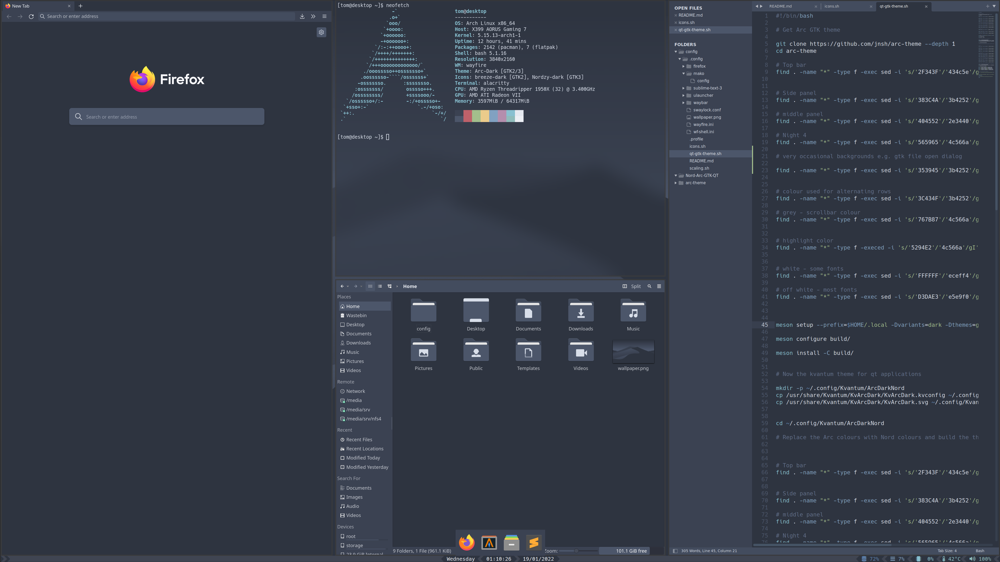

# Config and dotfiles 

## For my Wayfire desktop setup 




[Click here for a demonstration video](https://youtu.be/kU4qfl5CR5g)

This repo contains the configuration files for my Wayfire desktop set up. (Screenshot below). You can copy my entire set up but you probably want to pick and choose what you want.

This is more so that I can replicate the setup in future without having to remember everything but I figured since I had a few unique tweaks I'd share.


## Distro

Several of the commands assume you use Arch, if you're on a different distro, you'll need to substitute the commands for installing packages.

## Things you will almost certainly want to change before you start

My monitors are defined in the `[output:` sections of `.config/wayfire.ini`, you'll want to replace these with your own config.

I am using a high DPI mouse on a 4k monitor. You will almost certainly want to set `mouse_cursor_speed = 0` and `mouse_accel_profile = default` in `.config/wayfire.ini`.


## Installation

Copy the files from the `.config` directory your `~/.config` directory, pick and choose the applications you wish to configure.


### Icons

Run `icons.sh`.

I couldn't find a set of good Nord icons. I like Papirus but the folder icon's don't match the colour scheme at all. I've provided a script, `icons.sh` which replaces the colours in the folder icons with nord colours. In addition, it copies the small stencil icons from breeze-dark as they look a lot nicer (imho) in smaller UI elements such as file pickers and the sidebar of Dolphin.


### GTK and Qt themes

I'm using a customised Arc for both Qt and GTK for a consistent look/feel. The script `qt-gtk-theme.sh` downloads, modifies and installs the Qt and GTK themes.

Set the GTK theme to `Arc-Dark` using an environment (e.g. Wayfire launcher script or `/etc/environment`), set the QT style to kvantum and select `ArcDarkNord` in kvantummanager. You'll also want to set the platformtheme to `qt5ct` so you can use the `qt5ct` tool to set the icons and cursor theme of your choice.

```
QT_QPA_PLATFORMTHEME=qt5ct
GTK_THEME=Arc-Dark
QT_STYLE_OVERRIDE=kvantum
```


# Required packages

Below are the packages required for the desktop:

```
# pacman -S meson kvantum qt5ct swaylock mako glib2 alacritty firefox dolphin plasma-systemmonitor

$ yay -S wayfire-git wayfire-shell-git waybar ulauncher grim slurp wl-clipboard
```

Official repos:

alacritty - terminal
meson - building the arc theme
kvantum - for styling qt applications
qt5ct - to set icons in qt applications
glib2 - gsettings for setting icons/font dpi in gtk applications


AUR packages

wayfire-git
wayfire-shell-git (note: must currently build from source as wayfire-git and wayfire-shell-git conflict)
wl-clipboard - cli copy/paste used by grim and slurp for screenshots
grim - takes screenshots
slurp - allows selecting a portion of the screen for screenshots
ulauncher - application launcher


## Shortcuts 

### Launchers

`Win+Enter`: Alacritty
`Win+Shift+Enter`: Ulauncher
`Win+F`: Firefox
`Win+D`: Dolphin
`Print Screen`: Screenshot (using grim)
`Shift+Print Screen`: Screenshot area (using slurp + grim)
`Ctrl+Esc`: System monitor (plasma-systemmonitor) *I know it doesn't fit, my muscle memory is used to this from years of using KDE previously...*
`Win+L`: Lock session (swaylock)

### Window Control (focused application)

`Win`: (press+release) show expo to display all workspaces 
`Win+Left Mouse Drag`: Move current window
`Win+Right Mouse Drag`: Resize current window
`Win+Q`: Quit application
`Win+M`: Minimize

### Workspace Control:

`Win+[Num]`: Switch to workspace `[Num]`
`Win+Shift+[Num]`: Send focused window to workspace `[Num]`


### Effects

`Win+Scroll wheel`: Zoom
`Win+Ctrl+F`: Fisheye

